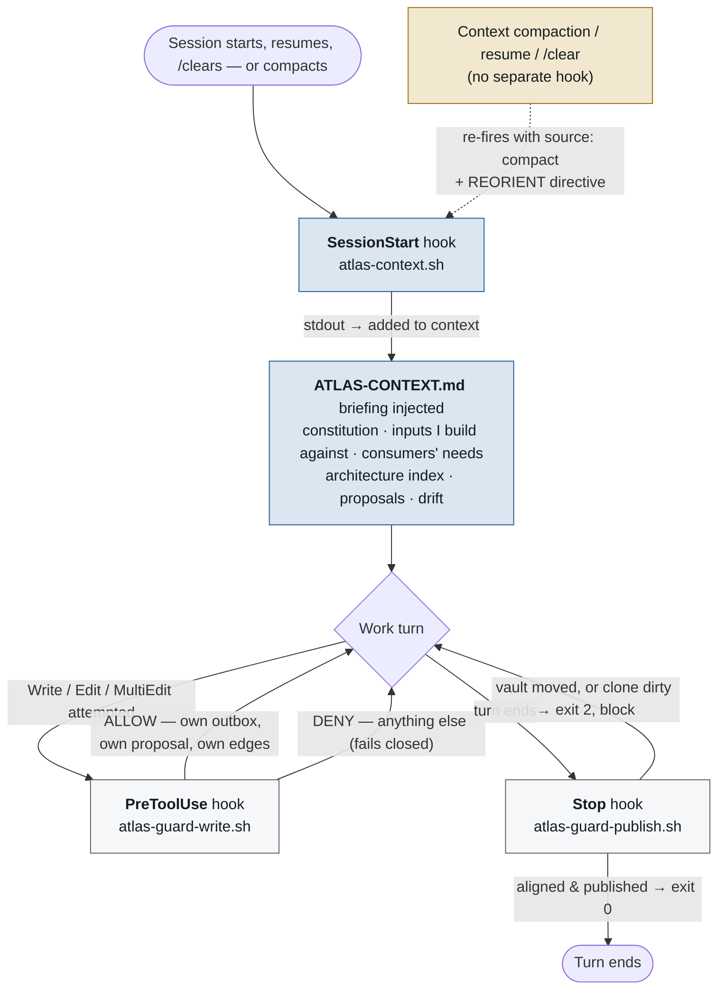

# The context plane — how Atlas fills and guards an agent's window

Atlas holds what is true; three hooks put the right slice of it in front of the agent at
the moment it's needed — and keep the rest out. **The reads are compiled and injected,
never trusted to happen.** This is the full lifecycle for a component seat.

> A richly-designed version of this diagram ships beside this file as
> [`context-plane.html`](context-plane.html) — open it in a browser (GitHub shows HTML
> as source, not rendered).

## The three hooks

Every seat's `.claude/settings.json` wires exactly these. A hook is a shell script Claude
Code runs at a lifecycle moment; what it prints and the code it exits with are how Atlas
reaches into the session.

| Hook | Script | Fires | Does |
|---|---|---|---|
| **SessionStart** | `atlas-context.sh` | startup · resume · `/clear` · **compaction** (no matcher) | Compiles the whole reading list and prints it to stdout — Claude Code adds it to the context window. The main injection, and the only one. |
| **PreToolUse** | `atlas-guard-write.sh` | before every `Write` / `Edit` / `MultiEdit` / `NotebookEdit` | Decides per file whether the write may land. Allows the seat's own outbox, an additive proposal, and edges naming it; denies everything else with a reason; fails closed. |
| **Stop** | `atlas-guard-publish.sh` | end of every turn | Two checks that can exit 2 to refuse the turn's end: the **alignment gate** (vault moved since the briefing? re-brief) and the **publish nag** (vault clone dirty? `/atlas-publish`). Fails open offline. |

*(An arch seat has no slug and works the vault directly: `SessionStart` runs
`atlas-arch-context.sh` (`--emit-arch-context`) and `Stop` runs the arch alignment gate;
there is no write guard, because the arch seat authors the vault as its reviewer.)*

## Reorientation is a source, not a separate hook

There is **no separate compaction or reorientation hook** — and that is why `SessionStart`
carries no matcher. When the window is summarised, resumed, or cleared, the same hook
re-fires with its `source`, rebuilds the briefing from scratch, and prepends a directive:

| `source` | What it means | Reorientation? |
|---|---|---|
| `startup` | a fresh session | briefing injected plainly; agent also reads `AGENTS.md` |
| `compact` | context was summarised to fit | **yes** — REORIENT prepended |
| `resume` | a session picked back up | **yes** — REORIENT prepended |
| `clear` | the window was deliberately wiped | **yes** — REORIENT prepended |

The prepended banner, verbatim:

> ⟳ **REORIENT — session was compacted.** Your working context was just rebuilt. Before
> your next action: read the briefing below in full, confirm which component you are and
> what you were doing, and resume from it. This is your complete orientation — do **not**
> ask the operator to re-orient you.

Atlas rebuilds the whole briefing rather than trying to preserve fragments through the
summary — the durable orientation is the compiled file, not whatever survived compaction.

## What the briefing carries — and what it doesn't

Injected, in emit order: the **constitution** (full); the **architecture-in-force** index
and **reference-library** index (read on demand — listing them makes reading retrieval,
not browsing); cross-vault **inputs** routed to this consumer; the seat's **shared needs**
once; per component, the **inputs it builds against** and its consumers' **open needs**;
**in-flight proposals**; and the **drift summary**.

Kept out on purpose: the **wider vault** (the retrieval invariant — read the briefing, fix
the graph if it's insufficient); **raw contract artifacts** (delivered as files to
`ATLAS-CONTEXT.d/`, referenced by path, never inlined); **other components' deliveries**
(one index line, not the body); and **answered or retired needs** (collapsed or dropped —
a briefing carries current obligations, not history).
