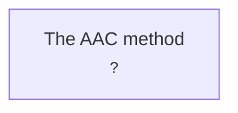

# I/O Graph (rendered)

> **Generated file** — generated by tools/atlas_validate.py — edit registry/io-graph.yml instead.
> Arrows point **provider → consumer** (upstream → downstream).

**Legend:** solid = x-as-a-service · thick `==` = collaboration · 🟠 minor drift · 🔴 breaking drift · ⚪ contract not yet published in Atlas.

## Edges

| Provider → Consumer | Interface | Mode | Pinned | Latest | State |
|---|---|---|---|---|---|
